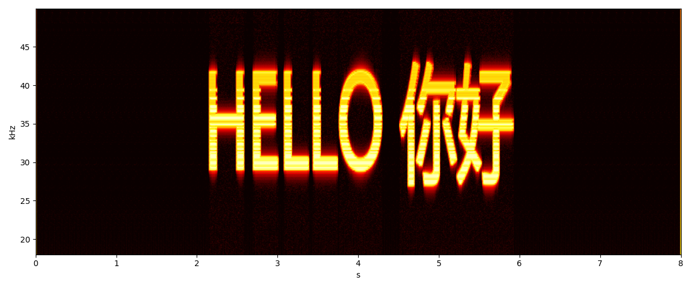

# 无敌章鱼哥出品：频谱画家

**Invincible Squidward Presents: Spectrum Painter**

在声音里画画。把文字藏进 20kHz 以上的超声波频段 —— 耳朵听不见，频谱看得见。

*Paint in sound. Hide text in the ultrasonic band above 20 kHz — inaudible to the ear, visible on a spectrogram.*

---

## 截图 | Screenshot



*「HELLO 你好」清晰地悬浮在 25–45 kHz 频段（Spek 同款 hot 配色）*

---

## 这是什么？| What is this?

**频谱画家** 是一个 Windows 桌面工具：载入一首音乐，在频谱图上框选一块区域，输入文字，它会将文字通过 IFFT 合成到该区域对应的超声波频段中，与原曲混音后导出 **24-bit / 192kHz** 无损文件（WAV / FLAC）。用普通耳机听不出任何异常，但在 Spek 等频谱软件中能看到清晰的悬浮文字。

**Spectrum Painter** is a Windows desktop tool: load a song, drag-select a region on the spectrogram, type your text — it synthesizes the text into the ultrasonic band via IFFT, mixes it into the music, and exports a **24-bit / 192 kHz** lossless file (WAV / FLAC). Nothing sounds unusual on normal headphones, but spectrogram software (e.g. Spek) reveals crisp floating text.

## 原理 | How it works

- **奈奎斯特定理**：44.1kHz 采样率最多记录 22.05kHz，而人耳上限约 20kHz。将采样率提升到 192kHz 后，20–96kHz 成为一块"听不见的空白画布"。
- **图像→声音**：文字渲染为黑底图像，取红色通道。每一列像素映射为一帧频谱（顶部=高频，底部=低频），像素亮度即该频点振幅，叠加伪随机相位避免啸叫，经 IFFT + Hann 窗 + 75% 重叠相加合成时域信号。
- **混音**：隐藏信号按可调增益（-50 ~ -20dB，默认 -40dB）混入原曲，峰值归一化到 0.99 防止削波。

- **Nyquist theorem**: 44.1 kHz sampling captures at most 22.05 kHz, while human hearing tops out around 20 kHz. At 192 kHz sampling, the 20–96 kHz band becomes a blank, inaudible canvas.
- **Image → sound**: text is rendered on black, red channel extracted. Each pixel column maps to one spectrum frame (top = high freq), pixel brightness becomes bin amplitude with pseudo-random phases, then IFFT + Hann window + 75% overlap-add synthesizes the time-domain signal.
- **Mixing**: the hidden signal is mixed at an adjustable gain (-50 to -20 dB, default -40 dB), peak-normalized to 0.99 to prevent clipping.

## 功能特性 | Features

- 🎵 支持 WAV / FLAC / OGG / MP3 输入，自动重采样到 192kHz
- 🖱️ 频谱图上鼠标拖框，自由选择时间 × 频率绘制区域
- 🔤 中英文文字渲染，可调字号、颜色（白/红），实时预览
- 🎚️ 隐藏增益滑块（-50 ~ -20 dB）
- 👁️ 合成后频谱即时刷新，所见即所得
- 💾 导出 24-bit / 192kHz WAV 或 FLAC
- 🖥️ 暗色专业音频软件风格界面，Spek 同款 hot 配色

- 🎵 WAV / FLAC / OGG / MP3 input, auto-resampled to 192 kHz
- 🖱️ Drag-select any time × frequency region on the spectrogram
- 🔤 Chinese & English text rendering with font size / color options and live preview
- 🎚️ Hidden-signal gain slider (-50 to -20 dB)
- 👁️ Spectrogram refreshes instantly after synthesis — what you see is what you get
- 💾 Export 24-bit / 192 kHz WAV or FLAC
- 🖥️ Dark pro-audio UI with Spek-style hot colormap

## 下载 | Download

前往 [Releases](../../releases) 页面下载 `SpectroStego.exe`，双击即用，无需安装 Python。

Grab `SpectroStego.exe` from the [Releases](../../releases) page — double-click and go, no Python required.

## 从源码运行 | Run from source

```bash
pip install PyQt5 numpy scipy pillow soundfile
python spectro_stego_app.py
```

## 打包 EXE | Build the EXE

```bash
pip install pyinstaller
pyinstaller SpectroStego.spec
```

产物在 `dist/SpectroStego.exe`（约 88MB）。
Output: `dist/SpectroStego.exe` (~88 MB).

## 使用步骤 | Usage

1. **打开音频** — 载入音乐文件（建议 192kHz 无损，其他采样率会自动重采样）
2. **输入文字** — 设置字号和颜色，左侧实时预览
3. **框选区域** — 在频谱图上拖动鼠标（建议 20kHz 以上，如 25–55kHz）
4. **合成** — 点击「合成到音频」，频谱图刷新验证效果
5. **导出** — WAV 或 FLAC，用 Spek 打开验收

1. **Open audio** — load a track (192 kHz lossless recommended; other rates are resampled)
2. **Enter text** — set font size and color, live preview on the left
3. **Select region** — drag on the spectrogram (above 20 kHz recommended, e.g. 25–55 kHz)
4. **Synthesize** — click the synth button; the spectrogram refreshes for verification
5. **Export** — WAV or FLAC, then admire it in Spek

## 技术栈 | Tech Stack

| 组件 | 用途 | Purpose |
|---|---|---|
| PyQt5 | 界面与频谱图绘制 | GUI & spectrogram rendering |
| NumPy | IFFT / 重叠相加合成 | IFFT / overlap-add synthesis |
| SciPy | STFT 频谱分析 / 重采样 | STFT analysis / resampling |
| Pillow | 文字渲染 | Text rendering |
| soundfile (libsndfile) | 音频读写，24-bit WAV/FLAC | Audio I/O, 24-bit WAV/FLAC |

## 项目结构 | Project Structure

```
├── spectro_stego_app.py   # GUI 主程序 | GUI application
├── stego_core.py          # 核心算法：渲染/编码/混音/导出 | Core: render/encode/mix/export
├── test_stego.py          # 无界面自测脚本 | Headless self-test
├── SpectroStego.spec      # PyInstaller 打包配置 | PyInstaller spec
└── screenshot.png         # 效果截图 | Screenshot
```

## 免责说明 | Disclaimer

本项目仅供学习研究与娱乐。请勿将其用于侵犯版权、隐蔽通信等违反当地法律法规的用途。

For education and fun only. Do not use for copyright infringement, covert communication, or anything illegal in your jurisdiction.

---

*无敌章鱼哥出品 🐙 | Made with 🐙 by Invincible Squidward*
